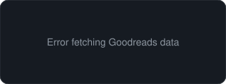

  

 

I'm a student studying Computer Science and Data Science. I enjoy exploring concepts that challenge the way I think, and I'm always looking for opportunities to learn more and build on what I know. This GitHub is where I track that progress and experiment with new ideas.

<h2>Tools & Tech</h2>

<h2>Other</h2>

<table>
<tr>
<td valign="top" align="center">

<strong>LeetCode</strong>
 

</td>
<td valign="top" align="center">

<strong>Currently Reading</strong>
 

</td>
</tr>
</table>

